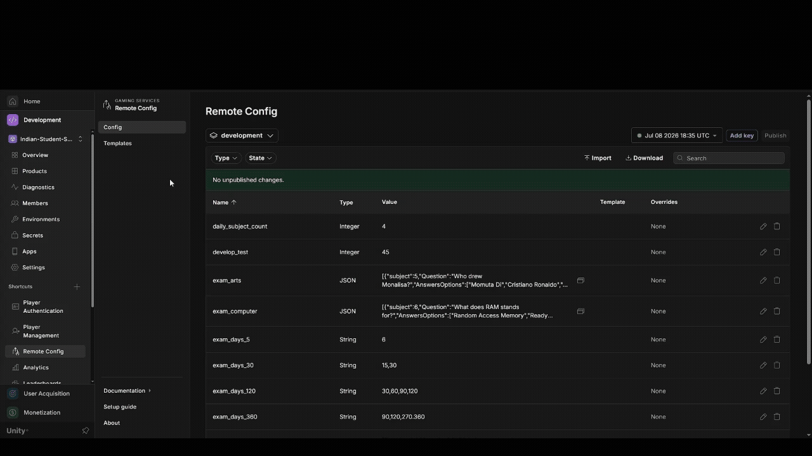
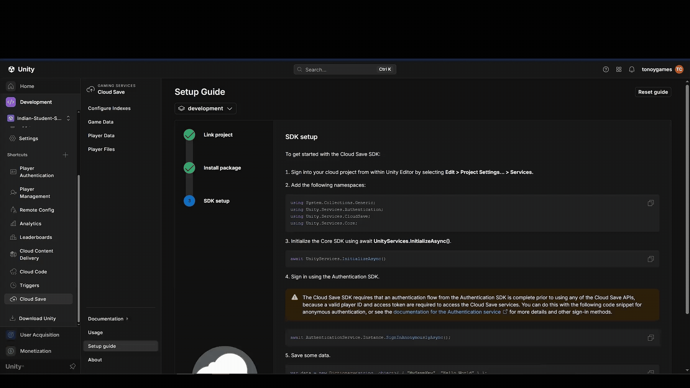
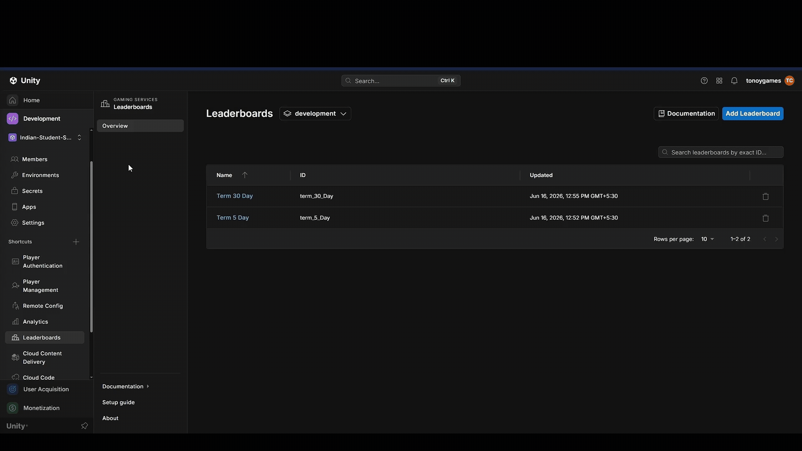
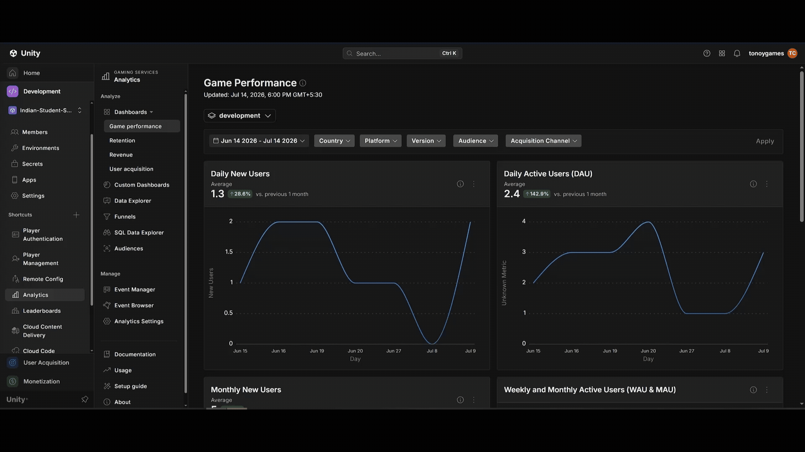

<div align="center">


<br/>


### 🎮 [Play in Browser](https://play.unity.com/en/games/0cc2ac5f-1f8f-4d27-8252-b06e62443b78/student-sim)

</div>

---

## 🎓 About The Game

**Student Sim** is a simulation that puts you in the shoes of a student, where your choices of action affect subject score, stamina, and exams.

> *Study hard. Manage your energy. Score high.*

---

## 🕹️ How to Play

- Each day your stamina refreshes and you get **12 interactions** to spend.
- Use your interactions wisely — choosing subjects increases your score, but every action costs stamina.
- Keep an eye on stamina: the day ends as soon as **either stamina or interactions hit 0**.
- On exam days, answer the questions correctly — your final score is based on your subject score and your number of correct answers.

---

## 🎮 Gameplay Overview

```
🔐 Login (guest or restored session)
        ↓
📋 Choose term length or Continue saved game
        ↓
📅 Daily loop — pick subjects, spend stamina & interactions
        ↓
📝 Exam days — multiple-choice exams (6 questions each)
        ↓
📊 Day summary → next day until term ends
        ↓
🏆 Term result — subject scores + exam multiplier
```

| Feature | Description | Done | Details |
|---|---|---|---|
| 📖 **Subject System** | Six academic subjects (Math, History, Science, Geography, Arts, Computer) plus Rest — each driven by ScriptableObject data | ✅ | — |
| ⚡ **Stamina & Interactions** | 100 stamina and 12 daily interactions; the day ends when either runs out | ✅ | — |
| 📝 **Exam Engine** | Scheduled exam days with multiple-choice questions and per-exam scoring | ✅ | — |
| 🎯 **Quest System** | Deadline-based quests with score targets and gold rewards | ✅ | — |
| 📊 **Term Scoring** | Academic base score multiplied by overall exam performance at term end | ✅ | — |
| 💾 **Save / Continue** | Progress persisted locally (PlayerPrefs); cloud save provider scaffolded | ✅ | — |
| ☁️ **Unity Gaming Services** | Guest authentication, analytics, and remote config integration | ✅ | [See below](#-feature-engineering--design-decisions) |
| 🛠️ **Remote Config (live tuning)** | Configure term/exam/economy values remotely without a build | ✅ | [See below](#-feature-engineering--design-decisions) |
| 🖼️ **Addressables + CCD** | Subject images and popups delivered via Addressables and Cloud Content Delivery | ✅ | [See below](#-feature-engineering--design-decisions) |
| 🔒 **Cloud Code (server-authoritative gold)** | Gold coin additions validated server-side via Unity Cloud Code | ✅ | [See below](#-feature-engineering--design-decisions) |
| ☁️ **Cloud Save** | Player data synced via Unity Cloud Save | ✅ | [See below](#-feature-engineering--design-decisions) |
| 🏆 **Leaderboard** | Integrated leaderboard for high scores | ✅ | [See below](#-feature-engineering--design-decisions) |
| 📆 **Extended Term Lengths** | 120 / 360-day terms with supporting data | ➡️ Moved | Cut from this project — see [note](#-scope-changes) |
| 🛍️ **Store + Ads + IAP** | Ads to boost score multiplier; simple IAP for Gold | ➡️ Moved | Cut from this project — see [note](#-scope-changes) |

> *Done column reflects current progress — will be corrected as features land.*
> ➡️ **Moved** = descoped from Student Sim and picked up in a different project instead of being built here.

---

## 🏗️ Project Architecture

```
Assets/
├── Scenes/
│   ├── LoginScene.unity          # UGS init + guest login
│   ├── SelectionScene.unity      # New game / continue
│   └── SampleScene.unity         # Main gameplay loop
├── ScriptableObjectsData/        # GameConfig, subjects, exams, quests
├── Scripts/
│   ├── Bootstrap/
│   │   ├── UnityService.cs           # UGS initialization & login flow
│   │   └── GameSessionContext.cs     # New game / continue session state
│   ├── Controller/
│   │   └── GameController.cs           # Wires services + event handlers
│   ├── Services/
│   │   ├── DayCycleService.cs          # Day start/end, exam days, term completion
│   │   ├── ExamService.cs              # Exam question flow
│   │   ├── PlayerStateService.cs       # Stamina, scores, levels, interactions
│   │   ├── PlayerSaveService.cs        # Save/load orchestration
│   │   ├── QuestService.cs             # Quest evaluation & rewards
│   │   ├── SubjectService.cs           # Subject data access
│   │   ├── SubjectSelectionService.cs  # Daily subject picks
│   │   ├── TermScoreCalculator.cs      # Final term grade formula
│   │   └── ...                         # Currency, interaction, config loaders
│   ├── UI/ & AdvanceUI/                # Scene & gameplay UI (exam, stats, quests, results)
│   ├── Saving/                         # PlayerSaveData, ISaveProvider, providers
│   ├── ScriptableObjectScripts/        # GameConfigSO, MainExam, SubjectsDataSingle, QuestData
│   ├── UGS/                            # Auth, analytics, remote config
│   └── GameEvents.cs                   # Static event bus between services & UI
└── Art/                                # UI textures & sprites
```

### Design Patterns Used
- **Service-oriented architecture** — gameplay logic split into focused services, orchestrated by `GameController`
- **ScriptableObject data** — subjects, exams, quests, and term config are asset-driven
- **Event-driven UI** — `GameEvents` decouples services from UI presenters
- **Save provider abstraction** — `ISaveProvider` with local and cloud implementations
- **Async with UniTask** — UGS init, login, and scene transitions

---

<div align="center">

## 🧠 Feature Engineering & Design Decisions

*How the systems work, why they were built this way, and what comes next.*

</div>

This section is the technical companion to the feature table above. Each system covers **what it does**, **how it is wired in code**, **the reasoning behind the approach**, **trade-offs**, and **planned improvements**.

---

### 🎯 Core Gameplay — Service Composition & Event Bus

**What it does**
Runs the daily loop: subject selection, stamina/interaction spending, exam days, quest evaluation, and term completion.

**How it is implemented**
- `GameController` is the composition root — it constructs every service, injects dependencies, and subscribes to `GameEvents`.
- Gameplay is split into single-responsibility services: `DayCycleService`, `PlayerStateService`, `SubjectInteractionService`, `ExamService`, `QuestService`, etc.
- UI never calls services directly; it raises/listens to static events on `GameEvents` (`OnSubjectSelected`, `OnDayEnded`, `OnExamCompleted`, …).
- Content comes from a **hybrid layer**: Remote Config JSON at runtime, ScriptableObject assets as offline fallback.

**Design thinking**
A simulation game has many interacting rules (stamina, quests, exams, saves). Putting all of that in one MonoBehaviour would make changes risky and testing painful. Services keep each rule isolated; `GameController` only wires them. The event bus avoids UI ↔ logic circular dependencies — presenters react to state changes without the services knowing about Canvas or TextMeshPro.

**Advantages & disadvantages**

| ✅ Advantages | ⚠️ Disadvantages |
|---|---|
| Easy to locate logic — each service has one job | `GameController` is a large wiring file |
| UI can be swapped or extended without touching rules | Static `GameEvents` are harder to trace than explicit interfaces |
| ScriptableObject fallbacks keep the game playable offline | Saves fire on every subject tap (local write-heavy) |
| Remote Config can override balance without a build | Some save fields (e.g. `interactionsAtCurrentLevel`) are not fully persisted |

**Future improvements**
- Introduce a lightweight `IGameEventBus` interface for testability
- Batch local saves (debounce like cloud saves) to reduce PlayerPrefs churn
- Extract term-length-specific logic into strategy objects for cleaner 5/30-day handling

---

### 🛠️ Remote Config — Live Balance Without a Build



**What it does**
Pulls tuning values and content JSON from the Unity Dashboard at login — stamina caps, daily interaction count, exam schedules, quest lists, and per-subject level data.

**How it is implemented**
- `UnityService` kicks off `UnityRemoteConfigService.InitializeAndFetchAsync()` immediately after UGS init (fire-and-forget).
- `GameController.InitializeDataAsync` waits up to **3 seconds** via `WaitUntilReadyAsync`; if RC isn't ready, defaults apply.
- `GameplaySettings.FromRemoteConfig()` snapshots tuning for the session (immutable for the term).
- Content loaders follow a **RC-first, ScriptableObject-fallback** pattern:
  - `SubjectDataLoader` → `subject_*` keys
  - `ExamDataRepository` → `exam_*` keys
  - `RemoteConfigQuestLoader` → `quests_config`
  - `GameConfigLoader` → `exam_days_5/30/120/360`

**Design thinking**
Shipping a balance tweak through app stores is slow. Remote Config moves numbers and even JSON content to the cloud so designers can iterate from the dashboard. The 3-second timeout and ScriptableObject fallbacks ensure the game **never soft-locks** on a failed fetch — a deliberate "offline-first resilience" choice for a portfolio/demo project that must always be playable.

**Advantages & disadvantages**

| ✅ Advantages | ⚠️ Disadvantages |
|---|---|
| Balance changes without rebuild or store review | Only fetched once at login — no mid-session refresh |
| Graceful fallback to local ScriptableObjects | `JsonUtility` parsing is rigid (no polymorphic arrays) |
| Session snapshot prevents mid-term rule changes | Reserved keys (`ads_enabled`, `store_catalog_json`) exist but are unused |
| Designers can iterate independently of code | 3s wait adds startup latency when RC is slow |

**Future improvements**
- Add a manual "Refresh config" path for returning players
- Migrate JSON parsing to `Newtonsoft.Json` or source-generated serializers for complex quest/exam schemas
- Wire reserved economy keys when store/IAP lands in the sibling project
- Environment-specific overrides (dev vs production) with visible in-game debug panel

---

### 🖼️ Addressables + CCD — On-Demand Asset Delivery

**What it does**
Loads the main game scene and subject icon sprites through Unity Addressables instead of bundling everything into the base build.

**How it is implemented**
- `AddressableKeys` centralises address strings (`scene_game`, `icon_subject_*`).
- `SelectionSceneUI` loads gameplay via `AddressableSceneLoader.LoadGameSceneAsync()` — not `SceneManager.LoadScene`.
- `SubjectVisualService` preloads all subject icons in parallel and injects sprites into `SubjectService`.
- Asset groups: **Local_core** (game scene) and **Content_Subject** (9 icon sprites).
- `Content_Subject` uses `ContentUpdateGroupSchema` with `m_StaticContent: 0` — prepared for live content updates.

**Design thinking**
Subject art is visual content that changes more often than code. Addressables decouple "what ships in v1.0" from "what we add next week." Even with local bundles today, the pipeline is CCD-ready: flip remote load paths and enable CCD without rewriting runtime code. Scene loading through Addressables also keeps the initial login/selection scenes lightweight.

**Advantages & disadvantages**

| ✅ Advantages | ⚠️ Disadvantages |
|---|---|
| Smaller initial download; assets load on demand | CCD is **prepared but not enabled** — still local bundles |
| New art can ship without a full app update (once CCD is on) | Icon load failures are silently swallowed — no user-facing retry |
| Clean handle lifecycle via `SubjectVisualService.Release()` | Only icons + scene use Addressables; gameplay data stays RC/SO |
| Parallel preload keeps first subject tap responsive | Remote catalog build is disabled (`m_BuildRemoteCatalog: 0`) |

**Future improvements**
- Enable CCD remote paths and remote catalog for `Content_Subject`
- Add placeholder/spinner UI state while icons stream (partially planned in docs assets)
- Extend Addressables to popup images and seasonal UI themes
- Surface load errors in a non-blocking toast instead of failing silently

---

### 🔒 Cloud Code — Server-Authoritative Gold

**What it does**
Moves gold currency grants to a server-side script so players cannot inflate their balance via save editing or memory tools.

**How it is implemented**
- `CloudCurrencyService` calls dashboard-hosted endpoints: `GetWallet`, `GrantGold`, `SpendGold`.
- `QuestService.CompleteQuestAsync` calls `GrantGoldAsync(questId, goldReward)` on quest completion.
- Server deduplicates grants by `questId`; response includes updated `gold` and `completedQuestIds`.
- Client updates `PlayerCurrencyService` cache only from server responses — never trusts local increments for rewards.

**Design thinking**
Local-only currency works for single-player prototypes, but any reward tied to effort (quests) is trivially exploitable. Cloud Code is the smallest UGS surface that still gives **real server authority** — no dedicated backend to host. Quest completion is the first integration point because it has a clear, verifiable trigger (deadline + score target met).

**Advantages & disadvantages**

| ✅ Advantages | ⚠️ Disadvantages |
|---|---|
| Gold grants cannot be faked client-side | `SyncWalletAsync` exists but is **never called at startup** |
| Server-side quest dedup prevents double-claiming | If Cloud Code fails, quest completes with **0 gold** — no local fallback |
| Same pattern used in production live-service games | `SpendGoldAsync` is implemented but unused (store descoped) |
| Minimal infra — scripts live in Unity Dashboard | Server scripts are not in this repo (dashboard-only) |

**Future improvements**
- Call `SyncWalletAsync` on login to reconcile client cache with server truth
- Add retry/backoff UI when grant fails (instead of silent 0 gold)
- Commit Cloud Code scripts to a `/CloudCode` folder for version control
- When store returns in sibling project, wire `SpendGoldAsync` with receipt validation

---

### ☁️ Cloud Save — Progress That Follows the Player



**What it does**
Syncs term progress and account data to Unity Cloud Save so a player can continue on a new device.

**How it is implemented**
- Two save domains, separate cloud keys:
  - `term_save_v1` — day, scores, quests, stamina, term progress
  - `account_save_v1` — player ID + wallet (cross-term)
- **Login:** `UnityService.OnAuthenticatedAsync` → `PlayerCloudSaveService.SyncCloudToLocalAsync()` merges cloud ↔ local by `lastSavedUtc` (last-write-wins).
- **During play:** `PlayerSaveService.Save()` writes PlayerPrefs immediately, then queues debounced cloud upload (35s) or force-flushes on pause/quit/term end.
- `ISaveProvider` / `CloudSaveProvider` abstraction exists; active logic lives in `PlayerCloudSaveService`.

**Design thinking**
Cloud Save adds latency and failure modes. Making PlayerPrefs the **source of truth during gameplay** means taps and day transitions never await a network round-trip. Cloud sync is async and debounced — good enough for a turn-based daily loop, bad for real-time multiplayer. Last-write-wins merge is simple and predictable for a single-player save; conflict resolution UI would be over-engineering at this scale.

**Advantages & disadvantages**

| ✅ Advantages | ⚠️ Disadvantages |
|---|---|
| Playable offline; cloud is enhancement, not blocker | Gold in account save can drift from Cloud Code until next grant |
| Debounced uploads reduce API cost | Cloud sync errors at login are swallowed — player may not know |
| Corrupt cloud keys are deleted with local fallback | Keys loaded one-at-a-time (safer, slower) |
| New game cleanly deletes both cloud keys | `CloudSaveProvider` stub is unused — two parallel abstractions |

**Future improvements**
- Unify save abstraction — move all cloud logic behind `ISaveProvider`
- Reconcile wallet from Cloud Code after cloud save merge
- Add optional "cloud save found — use cloud or local?" prompt for true conflicts
- Compress save payloads if term data grows (120/360-day support elsewhere)

---

### 🏆 Leaderboard — Comparing Term Scores



**What it does**
Submits each player's final term score to a Unity Leaderboard and displays top entries plus the current player's rank.

**How it is implemented**
- `TermLeaderboardIds` maps term length → board ID (`term_5_Day`, `term_30_Day`).
- On term end: `DayCycleService.CompleteTerm` → `TermScoreCalculator.Build()` → `TermLeaderboardService.SubmitScoreAsync`.
- Score formula: `finalScore = academicBase × (1 + examScoreMultiplier × totalExamCorrect / maxExamCorrect)`.
- `LeaderboardPanelUI` fetches top 20 with an in-memory cache; `InvalidateCache` on submit.
- Login sets display name to player ID via `EnsurePlayerNameIsIdAsync()`.

**Design thinking**
Leaderboards need authenticated identities — guest auth via UGS was already required for Cloud Save, so leaderboard submission adds almost no new friction. Separate boards per term length keep comparisons fair (a 30-day grind shouldn't compete with a 5-day sprint). Fire-and-forget submit avoids blocking the term result screen on network failure.

**Advantages & disadvantages**

| ✅ Advantages | ⚠️ Disadvantages |
|---|---|
| Zero extra sign-up — guest ID is the identity | Player name = raw player ID (not human-friendly) |
| Per-term-length boards keep rankings fair | Only 5- and 30-day boards active; 120/360 disabled in UI |
| Cached fetch keeps panel snappy | Submit has no retry — failed uploads are lost |
| Graceful degradation returns null/false on failure | Cache can show stale ranks until force refresh |

**Future improvements**
- Let players set a display name (stored in account save, validated server-side)
- Add submit retry queue persisted across sessions
- Enable 120/360-day boards when those terms ship in sibling project
- Show "your rank" even when outside top 20 with a dedicated API call

---

### 📊 Analytics — Tracking Player Milestones



**What it does**
Sends custom events to Unity Analytics so game starts, authentication, and key milestones show up in the UGS Game Performance dashboard.

**How it is implemented**
- `GameAnalyticsService` wraps `AnalyticsService.Instance` and is initialised in `UnityService.OnServicesReady()`.
- Custom events include `Game_Started` (on UGS init) and `Game_Authenticated` (after guest login or session restore).
- Events are flushed immediately after send so they appear in the dashboard without waiting for batch upload.

**Design thinking**
Analytics is the cheapest UGS feature to integrate and the most valuable for a portfolio project — it proves the live-service pipeline works end-to-end. Custom events were kept minimal (start + auth) to avoid noise; richer funnel events (day completed, term ended, quest failed) are natural next steps once balance stabilises.

**Advantages & disadvantages**

| ✅ Advantages | ⚠️ Disadvantages |
|---|---|
| Zero gameplay impact — fire-and-forget events | Only two custom events wired today |
| Visible proof of live players in UGS dashboard | No in-game analytics debug overlay |
| Works with guest auth — no PII required | Event schema not documented in repo |
| Same SDK as production Unity titles | No funnel/cohort analysis configured yet |

**Future improvements**
- Add events for `Day_Completed`, `Exam_Finished`, `Quest_Completed`, `Term_Ended`
- Attach term length and day number as event parameters for segmentation
- Set up a Funnel dashboard (login → first day → first exam → term complete)

---

### ☁️ UGS Bootstrap — Authentication & Offline Resilience

**What it does**
Initialises Unity Gaming Services on the login scene: anonymous auth, analytics, and parallel startup of Remote Config, Cloud Save sync, and leaderboard setup.

**How it is implemented**
- `UnityService` runs `UnityServices.InitializeAsync` with environment name + ID.
- Session restore via `PlayerAuthenticationService.TryRestoreSessionAsync()` skips the guest button when possible.
- On auth success: analytics event, cloud save sync, leaderboard name setup, then load `SelectionScene`.
- On init failure: guest button loads selection scene in **offline mode** — no cloud features, local play still works.

**Design thinking**
UGS should enhance the game, not gate it. A portfolio WebGL build must load even when services are down or blocked. Failing open to offline mode demonstrates production awareness: always define what happens when the network doesn't cooperate.

**Advantages & disadvantages**

| ✅ Advantages | ⚠️ Disadvantages |
|---|---|
| Auto session restore reduces friction | Offline mode silently drops all cloud features |
| Parallel RC fetch while player reads UI | No in-game indicator of "online vs offline" status |
| Analytics fires on meaningful milestones | Environment ID is serialized in scene — easy to misconfigure |
| Single bootstrap class owns all UGS startup | Tight coupling between login scene and every UGS service |

**Future improvements**
- Visible connection status badge (online / offline / syncing)
- ScriptableObject or Remote Config for environment IDs per build target
- Lazy-init non-critical services (leaderboard) after gameplay scene loads

---

## 🔍 Feature Deep Dives

A closer look at how a few of the trickier systems actually work, in plain language — with screen recordings from the Unity Dashboard and in-game.

<details>
<summary><strong>📊 Analytics — game performance in the dashboard</strong></summary>

<br/>


**What it does:** sends custom events to Unity Analytics so player activity shows up in the UGS Game Performance dashboard (DAU, new users, retention).

- `GameAnalyticsService` fires `Game_Started` when UGS initialises and `Game_Authenticated` after guest login or session restore.
- Events flush immediately so they appear in the dashboard without waiting for batch upload.
- The Game Performance view tracks daily active users, new users, and retention over time — useful for validating that the WebGL build and auth flow actually work in the wild.

</details>

<details>
<summary><strong>🛠️ Remote Config — live tuning without a build</strong></summary>

<br/>


**What it does:** lets balance numbers (stamina cost, exam question count, gold rewards, etc.) live in the Unity Cloud Dashboard instead of being hard-coded, so they can change without shipping a new build.

- On startup, `UnityService` finishes UGS init and then asks Remote Config for the latest values.
- Those values overwrite the defaults on the relevant `ScriptableObject`/config classes in memory only — nothing is written back to disk.
- If the fetch fails (no internet, service down), the game silently falls back to the local defaults so it never soft-locks.
- Designers can push a balance change (e.g. lower stamina drain) from the dashboard and every player gets it on next launch — no app store review needed.

</details>

<details>
<summary><strong>🖼️ Addressables + CCD — images that load on demand</strong></summary>

<br/>

<video src="docs/clips/addressables-demo.mp4" width="100%" controls>
  <a href="docs/clips/addressables-demo.mp4">Download Addressables demo clip</a>
</video>

**What it does:** subject artwork and popup images are packaged as Addressable assets and hosted on Unity Cloud Content Delivery (CCD) instead of being baked into the app.

- Assets are tagged with Addressable keys instead of being dragged into scenes directly.
- At runtime, the relevant service requests the asset by key; Addressables checks a local cache first, then downloads from CCD if it's missing or outdated.
- This keeps the initial app download small and lets new subject art/popups be pushed later without a full app update.
- A basic loading/placeholder state is shown while an image streams in, so the UI never shows a blank box.

</details>

<details>
<summary><strong>🔒 Cloud Code — server-authoritative gold</strong></summary>

<br/>

<video src="docs/clips/cloud-code-demo.mp4" width="100%" controls>
  <a href="docs/clips/cloud-code-demo.mp4">Download Cloud Code demo clip</a>
</video>

**What it does:** stops the gold currency from being something a player could edit locally (via save-file tampering or memory editing) by moving the "add gold" logic to a server-side script.

- Instead of the client incrementing a gold value directly, it calls a Cloud Code endpoint with the reward context (e.g. "quest X completed").
- The Cloud Code script re-validates that the reward is legitimate, then updates the authoritative balance and returns the new total.
- The client only ever displays whatever the server says the balance is — it never trusts a locally-modified number.
- This is the same pattern real live-service games use to stop currency exploits.

</details>

<details>
<summary><strong>☁️ Cloud Save — progress that follows the player</strong></summary>

<br/>


**What it does:** syncs `PlayerSaveData` to Unity Cloud Save so progress isn't stuck on a single device.

- `PlayerSaveService` already abstracts saving behind `ISaveProvider` — Cloud Save is simply a second implementation of that interface, alongside the existing local (PlayerPrefs) one.
- On login, the game checks whether a cloud save exists and is newer than the local one; if so, it pulls it down before the daily loop starts.
- On key checkpoints (day end, term end), the save is pushed back up to the cloud in the background.
- Local save still exists as an offline fallback, so the game keeps working without a connection.

</details>

<details>
<summary><strong>🏆 Leaderboard — comparing term scores</strong></summary>

<br/>


**What it does:** submits each player's final term score to a Unity Leaderboard so results can be compared against everyone else who played.

- At term end, `TermScoreCalculator` produces the final score, which is submitted to the leaderboard service tied to the player's authenticated (guest) ID.
- The leaderboard screen fetches the top entries plus the current player's rank, so a player can see how they stack up even if they're not in the top list.
- Because authentication is already guest-based via UGS, no extra sign-up step was needed to make this work.

</details>

---

## 🛠️ Tech Stack

| Area | Technology |
|---|---|
| Engine | Unity 6.3 (6000.3.10f1) |
| Language | C# 9.0 |
| Render Pipeline | Universal Render Pipeline (URP) |
| UI | Unity uGUI · TextMesh Pro |
| Input | Unity Input System |
| Async | UniTask (Cysharp) |
| Backend | Unity Gaming Services — Authentication, Analytics, Remote Config, Cloud Code, Cloud Save, Leaderboards, Addressables + CCD |
| IDE | JetBrains Rider · Visual Studio |
| Target Platforms | Android · WebGL |

---

## 🗺️ Roadmap

**MVP**

- ✅ Core exam question flow
- ✅ Subject selection & daily interaction loop
- ✅ Stamina, levels, and per-subject score tracking
- ✅ Quest system with deadlines and rewards
- ✅ Day cycle with scheduled exam days
- ✅ Term scoring and result screen
- ✅ Login, selection, and scene transitions
- ✅ Save / continue (local persistence)
- ✅ Unity Gaming Services integration (auth, analytics, remote config)

**MVP done — Meta Features**

- ✅ Unity Remote Config configuration
- ✅ Unity Addressables + CCD for subject images and popups
- ✅ Unity Cloud Code for server-authoritative gold coin addition
- ✅ Unity Cloud Save for player data
- ✅ Leaderboard integration
- ➡️ 120 / 360-day term lengths with supporting data — *moved to a different project*
- ➡️ Store + Ads to boost score multiplier, IAP for Gold — *moved to a different project*
- ➡️ Sound effects & background music — *moved to a different project*
- ➡️ Localization — *moved to a different project*

---

## 📌 Scope Changes

A couple of items originally planned for Student Sim have been descoped and are being explored in a separate project instead, so they no longer appear as pending work here:

- **Extended Term Lengths (120 / 360-day terms)**
- **Store + Ads + IAP**
- **Sound effects & background music**
- **Localization**
- ~~AI Class Standings~~ and ~~Runtime AI player list~~ have been removed from the plan entirely (not moved, just cut).

---

## 👨‍💻 Author

**Tonoy Chakraborty**

[](https://www.linkedin.com/in/tonoy-chakraborty-9b703097/)
[](mailto:tonoychan55@gmail.com)

---

<div align="center">


*Built with Unity 6 · Made with ☕ and exam stress*

</div>
